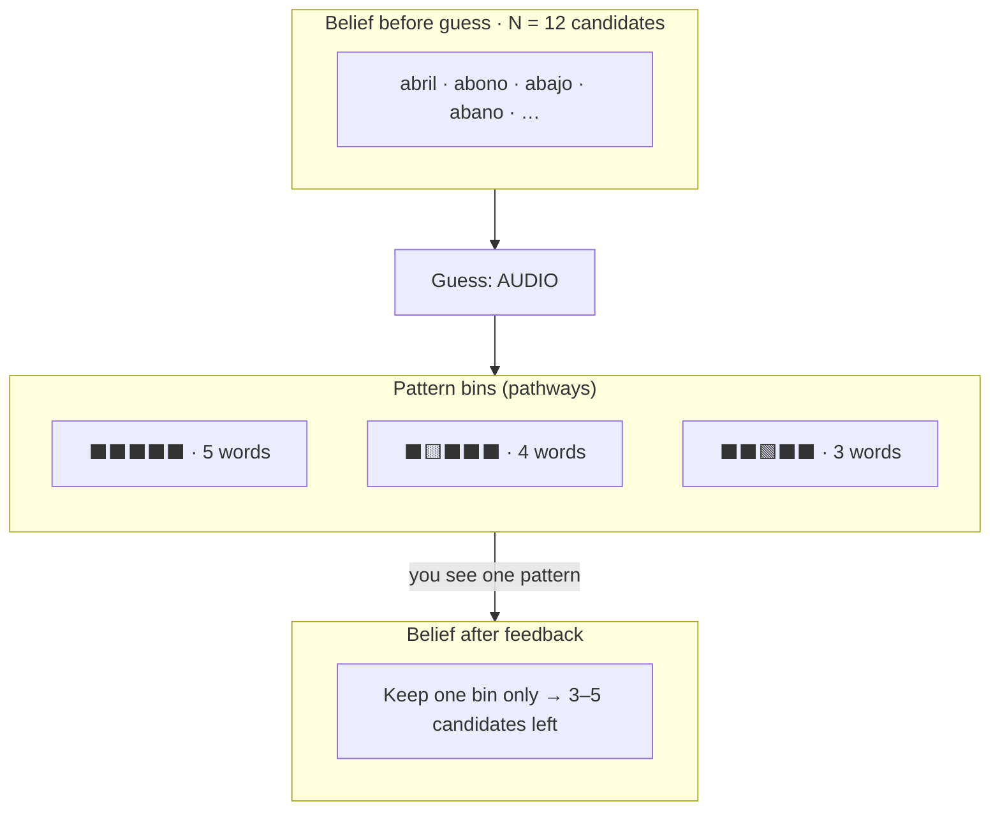
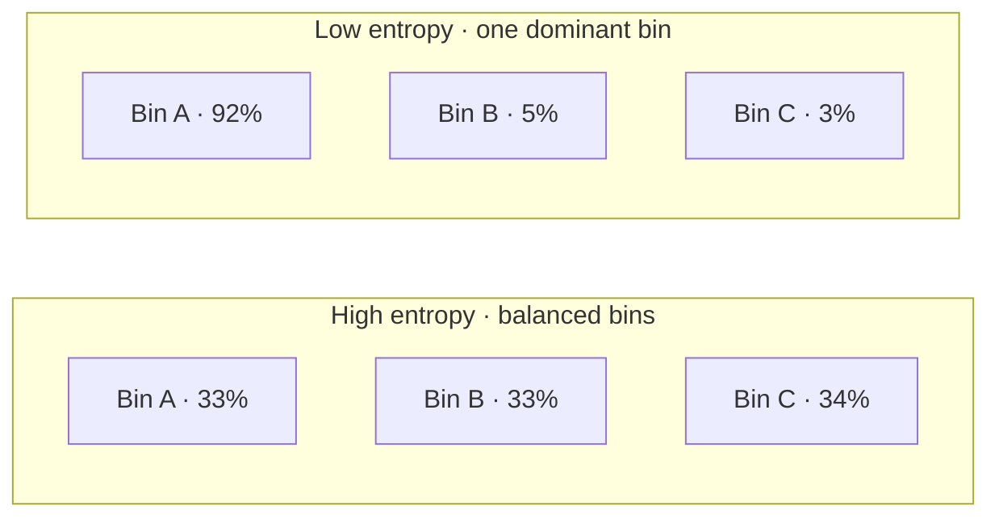

# Palabra Solver

Optimal entropy-based assistant for **La Palabra del Día** (Spanish Wordle).

- **Play** — mark gray / yellow / green feedback from your real game and get the next best guess.
- **Benchmark** — enter a secret word and watch the solver play it out.

## How the entropy solver works

Wordle is a **partially observable** guessing game: the secret is hidden, but each guess returns a color pattern (⬛ gray, 🟨 yellow, 🟩 green). The solver treats that as a filtering problem:

1. **Belief** — maintain the set of dictionary words still consistent with every guess so far.
2. **Partition** — for a candidate guess, group those words by the pattern each would produce.
3. **Score** — pick the guess whose pattern bins are as **evenly sized** as possible.
4. **Update** — after real feedback arrives, keep only the bin that matches and repeat.

The implementation lives in `solver/src/solver/belief.py` (belief update) and `solver/src/solver/model.py` (partition + entropy scoring). The agent evaluates guesses from the **full dictionary**, not only remaining candidates, so it can suggest strong “probe” words early on.

### Pattern bins (pathways)

Each guess splits the current belief into **bins** — one per possible feedback pattern. You only observe **one** bin after the guess; the others are paths you did not take.



**Stable vs. skewed splits.** A good entropy guess makes the bins similar in size — no matter which pattern appears, you eliminate roughly the same fraction of the belief. A bad guess puts almost every secret in one giant bin: most of the time you learn almost nothing, and only a rare pattern would narrow the search sharply.



That balance is what people mean by a **stable** strategy: outcomes are spread evenly, so expected progress per guess is predictable instead of relying on a lucky pattern.

### Mathematics

#### Belief state

After observations $(g_1, p_1), \ldots, (g_t, p_t)$, the belief is the set of secrets still compatible with the rules of Wordle feedback:

$$
\mathcal{B}_t = \{\, s \in \mathcal{W} \mid \forall i \le t:\ \mathrm{pattern}(s, g_i) = p_i \,\}
$$

We use a **uniform prior** over $\mathcal{B}_t$: every remaining word is equally likely to be the secret.

#### Partition induced by a guess

Fix a guess $g$ and current belief $\mathcal{B}$ with $N = |\mathcal{B}|$. Each secret $s \in \mathcal{B}$ produces an integer pattern $p = \mathrm{pattern}(s, g)$ (gray / yellow / green encoded as a single code). This defines a partition into bins:

$$
\mathcal{B} = \bigsqcup_{p \in \mathcal{P}(g)} B_p, \qquad B_p = \{\, s \in \mathcal{B} : \mathrm{pattern}(s, g) = p \,\}
$$

Let $n_p = |B_p|$. If the secret is uniform on $\mathcal{B}$, the probability of seeing pattern $p$ after guessing $g$ is:

$$
\mathbb{P}(p \mid g, \mathcal{B}) = \frac{n_p}{N}
$$

#### Shannon entropy of the split

The **expected entropy** (expected information, in **bits**) of guess $g$ is the Shannon entropy of that distribution:

$$
H(g) = -\sum_{p} \frac{n_p}{N} \log_2 \frac{n_p}{N}
$$

This is exactly what `WordleModel.expected_entropy` computes: group candidates into bins, then apply $-\sum p \log_2 p$.

**Interpretation:** $H(g)$ is the average number of bits of information you expect to gain from the feedback. Equivalently, if the secret were chosen uniformly from $\mathcal{B}$, observing the pattern reduces uncertainty from $\log_2 N$ bits to $\log_2 n_p$ bits; averaging over $p$ gives:

$$
\mathbb{E}[\text{reduction}] = \sum_p \frac{n_p}{N}\left(\log_2 N - \log_2 n_p\right) = H(g)
$$

#### Why maximize entropy?

The solver chooses:

$$
g^* = \arg\max_{g \in \mathcal{W}} H(g)
$$

(tie-break: lexicographically smallest word).

Maximizing $H(g)$ pushes the bin probabilities $n_p/N$ toward **equal size**. For a fixed number of bins $k$, entropy is largest when every bin has $n_p \approx N/k$ — the most **evenly distributed** split.

| Property | Effect |
|----------|--------|
| **Maximum** $H(g)$ | Bins are balanced → typical feedback shrinks the belief by a steady factor |
| **Minimum** $H(g)$ | One bin dominates → you usually stay in a huge candidate set |
| **Units** | Bits; $H(g) = \log_2 k$ when all $k$ bins are equal |

**Example.** $N = 8$ candidates, three bins of sizes 3, 3, 2:

$$
H = -\tfrac{3}{8}\log_2\tfrac{3}{8} - \tfrac{3}{8}\log_2\tfrac{3}{8} - \tfrac{2}{8}\log_2\tfrac{2}{8} \approx 1.56\ \text{bits}
$$

If instead bins were 7, 1, 0 (one heavy pathway):

$$
H \approx 0.54\ \text{bits}
$$

Same game, same dictionary — the balanced guess is preferred because it **maximizes expected information** regardless of which color pattern the game returns.

#### Closed form for two bins

When a guess splits the belief into exactly two patterns with counts $n$ and $N - n$:

$$
H(g) = -\frac{n}{N}\log_2\frac{n}{N} - \frac{N-n}{N}\log_2\frac{N-n}{N}
$$

This is maximized at $n = N/2$ (a perfect 50/50 split, $H = 1$ bit). Wordle partitions usually have more than two bins, but the same principle holds: **spread the probability mass evenly across pathways**.

---

## Stack

| Part | Tech |
|------|------|
| Solver | Python (`wordle-solver` package) |
| API | FastAPI |
| UI | React + Vite |

## Run locally

**Quick start (Git Bash on Windows):**

```bash
./init.sh
```

Opens the app at `http://127.0.0.1:5173` and prints LAN URLs for devices on the same Wi‑Fi.

**Manual:**

```bash
# Solver tests
make test

# Backend (port 9000)
cd backend && uv sync && uv run uvicorn app.main:app --reload --port 9000

# Frontend (port 5173, proxies /api → backend)
cd frontend && npm install && npm run dev
```

**CLI solver:**

```bash
cd solver && uv sync
uv run palabra suggest --guess audio02201
uv run palabra solve abril
```

### First run / caches

On first use the solver builds cached files (gitignored, regenerated automatically):

- `words_5.pickle` — normalized word list
- `word_5_dict.pickle` — pattern lookup matrix (~25 MB, ~45 s to build once)

By default these live under `data/`. On Railway, set `WORDLE_CACHE_DIR=/app/data/cache` with a volume mounted there.

## Dictionary

Word list: [`lemario-general-del-espanol.txt`](https://github.com/olea/lemarios/blob/master/lemario-general-del-espanol.txt) from [olea/lemarios](https://github.com/olea/lemarios) (public domain).

Bundled copy: `data/lemario-general-del-espanol.txt`.

## Deploy (Railway)

One service serves the React UI and `/api/*` from the same URL (see `backend/app/main.py` static mount).

### Railway

1. Push this repo to GitHub.
2. [Railway](https://railway.app) → **New Project** → **Deploy from GitHub** → select the repo.
3. Railway reads [`railway.toml`](railway.toml) and [`nixpacks.toml`](nixpacks.toml).
4. **Volume (recommended):** Service → **Volumes** → mount at **`/app/data/cache`**  
   Set env **`WORDLE_CACHE_DIR=/app/data/cache`**.  
   Persists pickles across deploys; lemario stays in the image at `data/lemario-general-del-espanol.txt`.
5. **Environment variables** (optional):

   | Variable | Value |
   |----------|--------|
   | `WORDLE_CACHE_DIR` | `/app/data/cache` (when using a volume) |
   | `CORS_ORIGINS` | Leave empty unless you need extra allowed origins |

6. Deploy. Open the generated public URL (e.g. `https://wordle-solver-production.up.railway.app`).
7. Verify: `/api/health` → `{"status":"ok"}`, `/` → app menu.

**Cost:** Railway Hobby plan (~$5/month) for always-on + volume.

- **Build:** `scripts/railway-build.sh` — npm build, copy to `backend/static`, `uv sync`
- **Start:** `scripts/railway-start.sh` — warm pickle cache, then uvicorn

### Environment variables

| Variable | Where | Purpose |
|----------|--------|---------|
| `WORDLE_CACHE_DIR` | Railway | Pickle cache directory on a mounted volume |
| `CORS_ORIGINS` | Railway / local backend | Extra allowed browser origins (comma-separated) |
| `VITE_API_URL` | Local frontend only | Leave empty; Vite proxies `/api` to port 9000 |

See [`backend/.env.example`](backend/.env.example). Local frontend dev does not need a `.env` file.

## License

MIT — see [LICENSE](LICENSE).

Word list data from [olea/lemarios](https://github.com/olea/lemarios) (public domain), not covered by MIT.
