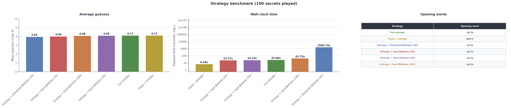

# Spanish Wordle Solver

Solvers for **La Palabra del Día** (Spanish Wordle) under a **uniform prior** over remaining dictionary words.

| Strategy | Opening | Hard | Threshold | Probes (Bellman) | Doc |
|----------|---------|------|-----------|------------------|-----|
| **full-entropy** | Entropy | no | — | — | [docs/entropy.md](docs/entropy.md) |
| **fixed-entropy** | User word (`acero` in benchmark) | no | — | — | [docs/entropy.md](docs/entropy.md) |
| **entropy-threshold-bellman** | Entropy | no | 20 | full dict | [docs/bellman.md](docs/bellman.md) |
| **entropy-hard-bellman** | Entropy | **yes** | 20 / 50 / 100 | candidates only | [docs/bellman.md](docs/bellman.md) |

While \|B\| ≥ threshold, Bellman strategies use greedy entropy with the full dictionary as the probe pool. Below the threshold they switch to Bellman DP; **hard** controls whether Bellman probes are restricted to remaining candidates (`yes`) or the full dictionary (`no`).

All strategies maintain a **belief** over compatible secrets and partition candidates by feedback pattern. See [docs/entropy.md](docs/entropy.md) for the shared filtering setup.

The web app and CLI expose the same six strategies benchmarked below. **Threshold Bellman** can be very slow in play — each suggestion below the belief threshold runs exact DP over the full dictionary.

## Benchmark results

100 fixed secret words (`data/benchmark_words.json`, seed 42), full 5-letter dictionary (~5k words), max 6 guesses. Regenerate with `make benchmark` or `uv run palabra benchmark`.



<table>
<tr>
<td valign="top">

<table>
<thead>
<tr>
<th align="left">Strategy</th>
<th align="right">Mean guesses</th>
<th align="right">Wall time (s)</th>
<th align="right">Solve rate</th>
</tr>
</thead>
<tbody>
<tr><td>Full entropy</td><td align="right">4.11</td><td align="right">25.7</td><td align="right">100%</td></tr>
<tr><td>Fixed + entropy</td><td align="right">4.11</td><td align="right">6.6</td><td align="right">100%</td></tr>
<tr><td>Entropy + threshold Bellman (20)</td><td align="right"><strong>3.95</strong></td><td align="right"><strong>1589</strong></td><td align="right">100%</td></tr>
<tr><td>Entropy + hard Bellman (20)</td><td align="right">4.00</td><td align="right">22.6</td><td align="right">100%</td></tr>
<tr><td>Entropy + hard Bellman (50)</td><td align="right">4.09</td><td align="right">24.2</td><td align="right">100%</td></tr>
<tr><td>Entropy + hard Bellman (100)</td><td align="right">4.08</td><td align="right">42.7</td><td align="right">100%</td></tr>
</tbody>
</table>

</td>
<td valign="top" style="padding-left: 1.25em;">

<table>
<thead>
<tr><th align="center">Opening word</th></tr>
</thead>
<tbody>
<tr><td align="center"><code>cario</code></td></tr>
<tr><td align="center"><code>acero</code> (fixed)</td></tr>
<tr><td align="center"><code>cario</code></td></tr>
<tr><td align="center"><code>cario</code></td></tr>
<tr><td align="center"><code>cario</code></td></tr>
<tr><td align="center"><code>cario</code></td></tr>
</tbody>
</table>

</td>
</tr>
</table>

**Takeaways**

- **Threshold Bellman (20)** is the most accurate solver here (3.95 mean guesses) but roughly **60× slower** than hard Bellman at the same threshold, because Bellman probes the entire dictionary instead of candidates only.
- **Hard Bellman (20)** is the recommended daily driver: 4.00 mean guesses in ~23 s — second-fastest among Bellman hybrids and nearly as accurate as threshold Bellman without the 26-minute runtime.
- **Fixed + entropy** is the fastest option (~6.6 s) but matches pure entropy on accuracy; use it when speed matters more than the Bellman endgame.

**Possible next steps**

- **Deep reinforcement learning** — train a policy or value network on simulated Wordle episodes to approximate Bellman-quality decisions without exhaustive DP at inference time.
- **Learned value function** — replace tabular Bellman memoization with a neural critic over belief summaries (entropy, candidate count, letter coverage).
- **Opening-book learning** — meta-learn openers per dictionary or language variant instead of fixed entropy picks.
- **Faster threshold Bellman** — stronger precomputation, candidate pruning, or anytime approximate DP to keep optimality where it matters without minute-long pauses.

Raw numbers: [outputs/results.json](outputs/results.json). Plot only: `uv run palabra benchmark --plot-only`.

```bash
cd solver && uv sync --extra benchmark
uv run palabra benchmark
# or: make benchmark
```

Regenerate the secret-word list: `uv run palabra benchmark --resample-words`.

## Development

```bash
make test
make checks
```

**CLI** (`solver/src/solver/cli/`):

| Command | Role |
|---------|------|
| `palabra play` | Interactive suggestions (web **Play** tab) |
| `palabra explore` | Solve a secret and show the path (web **Explore** tab) |
| `palabra benchmark` | Compare all strategies and export plots |
| `palabra stats` | Dictionary statistics |
| `palabra warm-bellman-cache` | Precompute Bellman cache |

```bash
cd solver && uv sync
uv run palabra play --guess audio02201
uv run palabra explore --strategy entropy-threshold-bellman abril
uv run palabra --strategy fixed-entropy --opening-word cario explore abril
uv run palabra --strategy entropy-hard-bellman@50 explore abril
```

Feedback encoding in `--guess`: `0` = gray, `1` = yellow, `2` = green (per letter, left to right).

Default strategy is **entropy-threshold-bellman**.

### First run / caches

On first use the solver builds cached files under `data/cache/` (gitignored, regenerated automatically):

- `data/cache/words_5.pickle` — normalized word list
- `data/cache/entropy_5_lookup_table.pickle` — pattern lookup matrix (~25 MB, ~45 s to build once)
- `data/cache/threshold_bellman_5_value_function.pickle` — memoized threshold Bellman value function (grows incrementally as you play)
- `data/cache/hard_bellman_5_value_function.pickle` — memoized hard-mode Bellman value function

By default these live under `data/cache/`. Override with the `WORDLE_CACHE_DIR` environment variable if needed.

## Dictionary

Word list: [`lemario-general-del-espanol.txt`](https://github.com/olea/lemarios/blob/master/lemario-general-del-espanol.txt) from [olea/lemarios](https://github.com/olea/lemarios) (public domain).

Bundled copy: `data/lemario-general-del-espanol.txt`.

## License

MIT — see [LICENSE](LICENSE).

Word list data from [olea/lemarios](https://github.com/olea/lemarios) (public domain), not covered by MIT.
